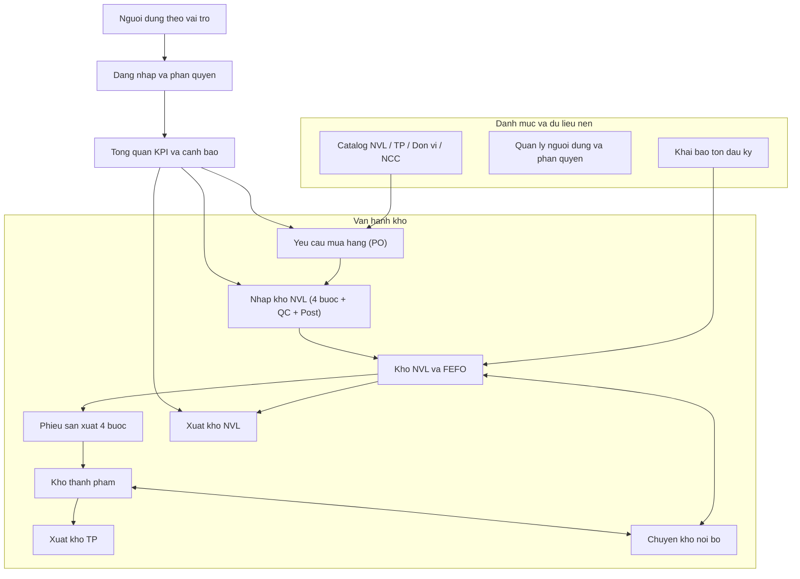
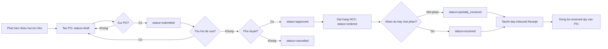
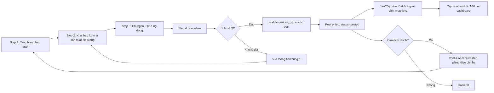
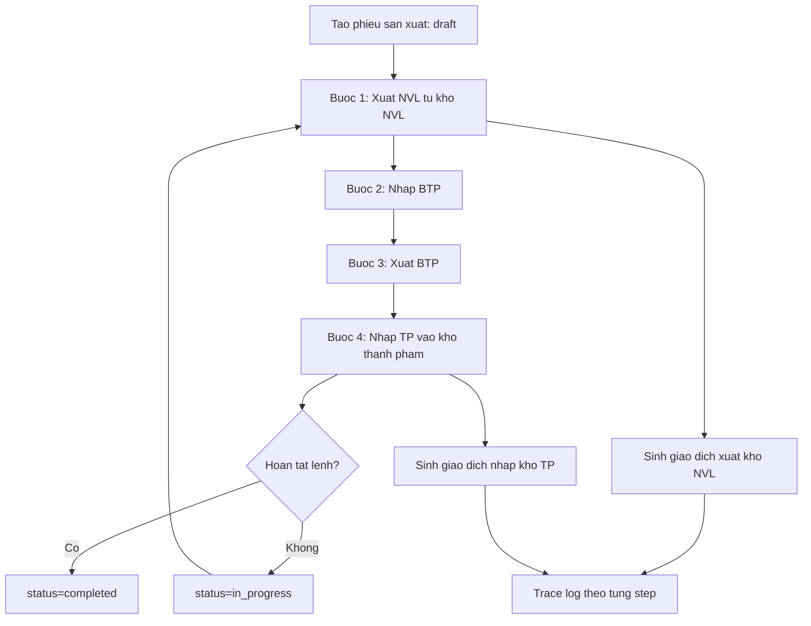
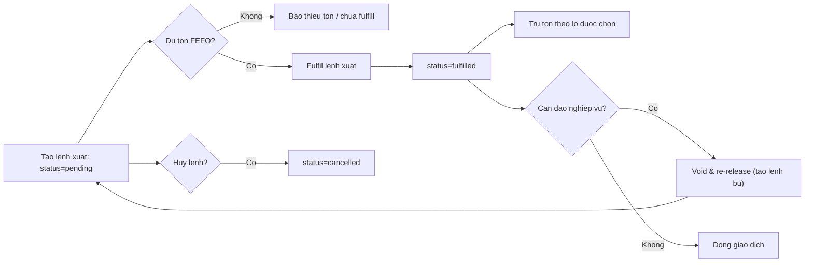
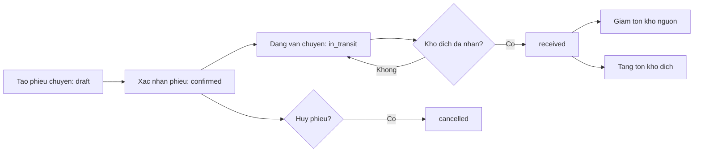

# Ra soat he thong va luu do nghiep vu (Mermaid)

Tai lieu nay tong hop nhanh cac phan he hien co va luong nghiep vu chinh dua tren route, API va quy tac trong du an.

## Mo nhanh tung luu do (khuyen nghi)

Neu plugin Mermaid cua ban dang parse ca file Markdown va bao loi "No diagram type detected", hay mo truc tiep cac file `.mmd` sau:

- `docs/mermaid/00-ceo-business-flow.mmd` (ban tom tat cho CEO)
- `docs/mermaid/01-system-map.mmd`
- `docs/mermaid/02-po-inbound-flow.mmd`
- `docs/mermaid/03-inbound-flow.mmd`
- `docs/mermaid/04-production-flow.mmd`
- `docs/mermaid/05-outbound-flow.mmd`
- `docs/mermaid/06-stock-transfer-flow.mmd`

## 1) Ban do chuc nang toan he thong

## 2) Luong mua hang (PO) va ket noi nhap kho

## 3) Luong nhap kho NVL (Inbound Receipt)

## 4) Luong san xuat 4 buoc (NVL -> BTP -> TP)

## 5) Luong xuat kho (NVL/TP) va dao phieu

## 6) Luong chuyen kho noi bo

## 7) Ghi chu ra soat

- Luong kho duoc van hanh theo FEFO va co co che QC truoc khi post nhap kho.
- PO co day du vong doi draft -> submitted -> approved -> ordered -> partially_received/received -> cancelled.
- Inbound va outbound deu co co che dao nghiep vu an toan theo huong tao phieu bu (void & re-receive / void & re-release).
- San xuat da mo hinh hoa 4 buoc ro rang, co ghi nhat ky va cap nhat ton kho theo huong xuat NVL, nhap TP.
