# G MES System Design Flow Chart

So do duoi day duoc ve lai theo nhom bo phan de de theo doi trach nhiem va diem ban giao.

```mermaid
flowchart LR
    START([Start])
    END([End])

    subgraph SALE[Sale]
        S1[1. Tiep nhan yeu cau khach hang]
        S2{Du thong tin bat buoc?}
    end

    subgraph RD[RnD]
        R1[2. Nghien cuu va tao cong thuc]
        R2{Du COA MSDS TDS IFRA?}
        R3{Nguyen lieu ngoai danh muc?}
        R4[3. Phat hanh du lieu ky thuat]
        R5{Version da approved?}
    end

    subgraph CEO[CEO]
        C1[CEO duyet ngoai le]
        C2{Duyet cho phep tiep tuc?}
    end

    subgraph PLANNING[Ke hoach]
        P1[4. Lap ke hoach san xuat]
        P2{Thieu nguyen lieu?}
        P3[9. Tao lenh san xuat]
        P4{Du cong thuc va LOT dat?}
    end

    subgraph PURCHASING[Mua hang]
        M1[5. Tao PO va thu hoa don]
    end

    subgraph WAREHOUSE[Kho]
        K1[6. Nhap kho nguyen lieu theo LOT]
        K2[11. Cap phat nguyen lieu theo LOT]
        K3[17. Nhap kho thanh pham]
        K4[18. Giao hang]
    end

    subgraph ACCOUNTING[Ke toan]
        A1{Trang thai hoa don FULL?}
    end

    subgraph QC[QC]
        Q1[7. QC dau vao]
        Q2{QC dau vao dat?}
        Q3[13. IPC]
        Q4{IPC dat?}
        Q5[15. QC thanh pham]
        Q6{QC thanh pham dat?}
    end

    subgraph QA[QA]
        QA1[8. QA duyet LOT]
        QA2{LOT dat?}
        QA3[16. QA duyet thanh pham]
        QA4{Thanh pham dat?}
    end

    subgraph PRODUCTION[San xuat]
        SX1[10. Phat hanh batch record]
        SX2[12. San xuat ban thanh pham]
        SX3[14. Dong goi]
        SX4[19. Dong ho so lo]
        SX5{Ho so lo day du?}
    end

    subgraph TRACE[Truy xuat CAPA Thu hoi]
        T1[20. Truy xuat CAPA Thu hoi]
    end

    START --> S1 --> S2
    S2 -- Khong --> S1
    S2 -- Co --> R1

    R1 --> R2
    R2 -- Khong --> R1
    R2 -- Co --> R3
    R3 -- Co --> C1 --> C2
    C2 -- Khong --> R1
    C2 -- Co --> R4
    R3 -- Khong --> R4

    R4 --> R5
    R5 -- Khong --> R1
    R5 -- Co --> P1

    P1 --> P2
    P2 -- Co --> M1 --> K1
    P2 -- Khong --> K1

    K1 --> Q1 --> Q2
    Q2 -- Khong --> M1
    Q2 -- Co --> QA1 --> QA2
    QA2 -- Giu --> QA1
    QA2 -- Loai --> M1
    QA2 -- Dat --> P3

    P3 --> P4
    P4 -- Khong --> P1
    P4 -- Co --> SX1 --> K2 --> A1

    A1 -- Khong --> C1
    A1 -- Co --> SX2 --> Q3 --> Q4
    Q4 -- Khong --> SX2
    Q4 -- Co --> SX3 --> Q5 --> Q6

    Q6 -- Khong --> SX3
    Q6 -- Co --> QA3 --> QA4
    QA4 -- Khong --> SX3
    QA4 -- Co --> K3 --> K4 --> SX4 --> SX5

    SX5 -- Khong --> SX4
    SX5 -- Co --> T1 --> END
```

## Chu thich gate rule

- Hard block: thieu COA MSDS TDS IFRA, LOT khong dat QC QA
- Soft block: thieu hoa don, can CEO duyet ngoai le
- Stop line: IPC khong dat
- Close gate: ho so lo khong day du thi khong cho dong
